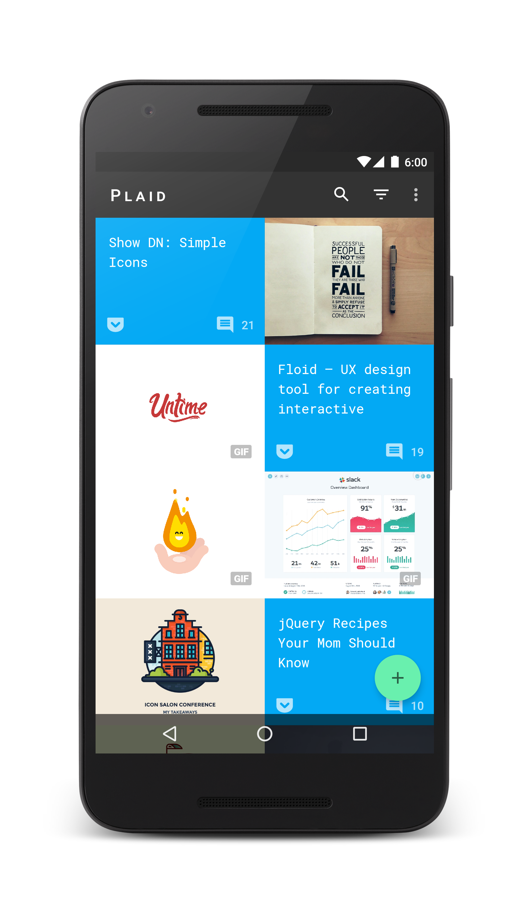
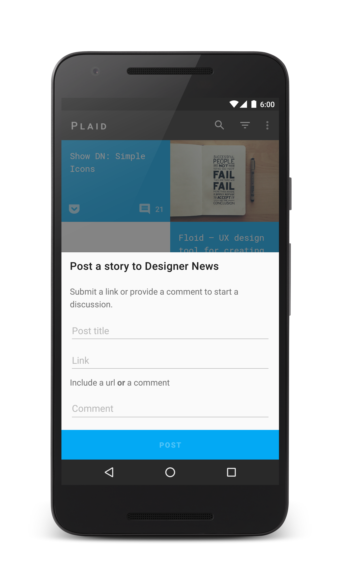
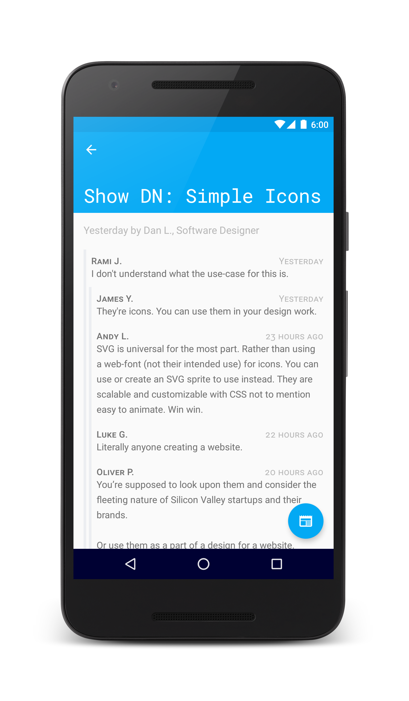
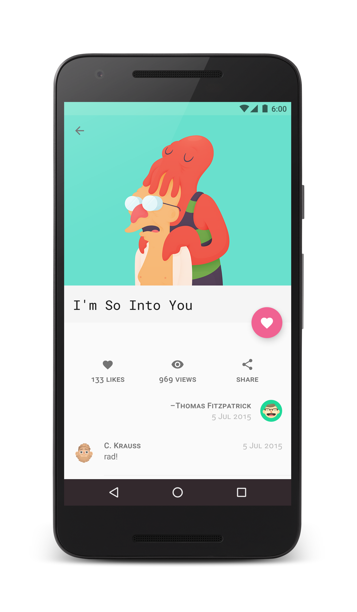

# Plaid


*Design news and inspiration.*

Plaid is a showcase of [material design](https://www.google.com/design/spec/) that we hope you will
keep installed. It pulls in news & inspiration from [Designer News](https://www.designernews.co/),
[Dribbble](https://dribbble.com/) & [Product Hunt](https://www.producthunt.com/). It demonstrates
the use of
[material principles](https://www.google.com/design/spec/material-design/introduction.html#introduction-principles)
to create tactile, bold, understandable UIs.

**[Install on Google Play (Beta Testing)](https://play.google.com/apps/testing/io.plaidapp)**


### Screenshots








### License


```
Copyright 2015 Google, Inc.

Licensed to the Apache Software Foundation (ASF) under one or more contributor
license agreements. See the NOTICE file distributed with this work for
additional information regarding copyright ownership. The ASF licenses this
file to you under the Apache License, Version 2.0 (the "License"); you may not
use this file except in compliance with the License. You may obtain a copy of
the License at

http://www.apache.org/licenses/LICENSE-2.0

Unless required by applicable law or agreed to in writing, software
distributed under the License is distributed on an "AS IS" BASIS, WITHOUT
WARRANTIES OR CONDITIONS OF ANY KIND, either express or implied. See the
License for the specific language governing permissions and limitations under
the License.
```
